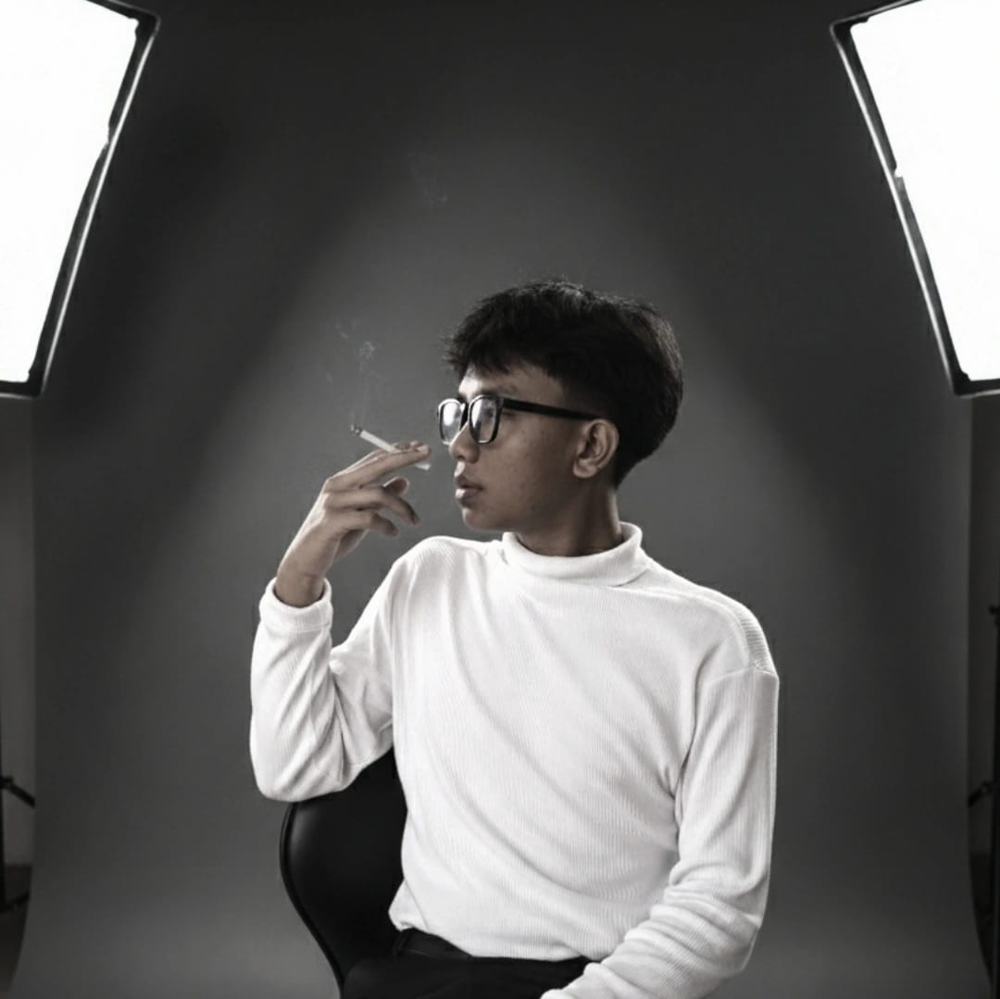
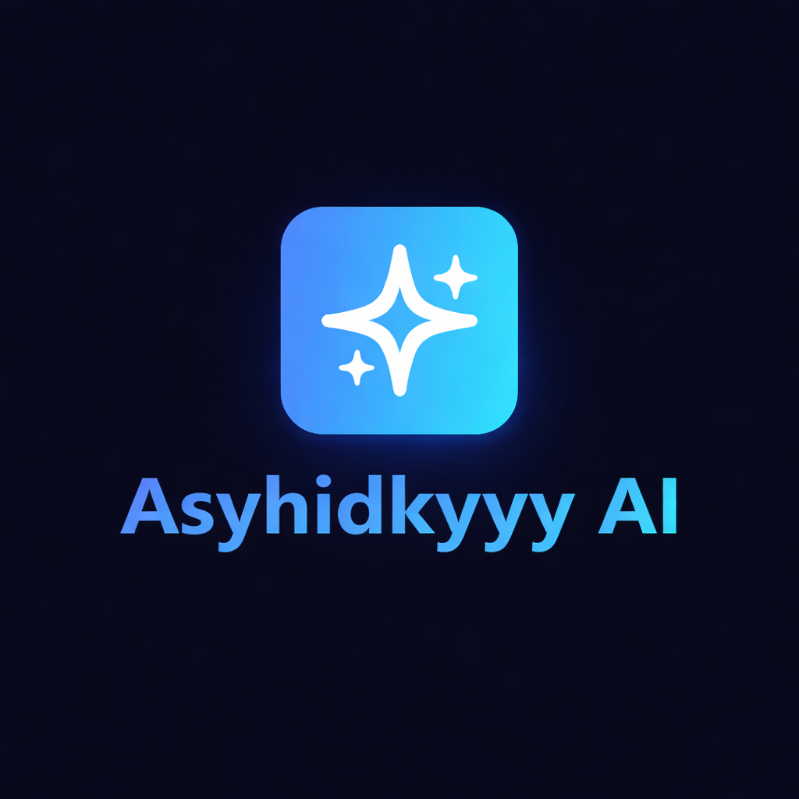

<!DOCTYPE html>
<html lang="id">
<head>
    <meta charset="UTF-8">
    <meta name="viewport" content="width=device-width, initial-scale=1.0">
    <title>Portofolio Pribadi - [Nama Anda]</title>
    <!-- Tambahan Font Awesome untuk ikon sosial media -->
    <link rel="stylesheet" href="https://cdnjs.cloudflare.com/ajax/libs/font-awesome/6.0.0/css/all.min.css">
    
</head>
<body>
    <header>
        <h2>Fakih Asyhidkyy</h2>
        <nav>
            <ul>
                <li><a href="#hero">Beranda</a></li>
                <li><a href="#about">Tentang</a></li>
                <li><a href="#portfolio">Portofolio</a></li>
                <li><a href="#contact">Kontak</a></li>
            </ul>
        </nav>
    </header>

    <section id="hero" class="visible">
        

            <h1>Welcome to my website</h1>
            
Development tools ai

            <a href="#about" class="btn">Pelajari Lebih Lanjut</a>
        

    </section>

    <section id="about">
        

            

                 <!-- Ganti dengan URL foto pertama Anda -->
                 <!-- Ganti dengan URL foto kedua Anda -->
            

            

                <h2>Tentang Saya</h2>
                
saya seorang pelajar yang menyukai teknologi dan saya berinovasi membuat berbagai tools ai yang simpel dan mudah digunakan , dan saya juga sangat tertarik dengan hal-hal baru maka dari itu saya mempelajari ai dan cara membuat tools nya,

            

        

    </section>

    <section id="portfolio">
        

            <h2>Portofolio</h2>
            

                

                    <a href="https://example.com/project1" target="_blank"> <!-- Ganti dengan URL proyek Anda -->
                        
                    </a>
                    <h3>GEMINI NANO </h3>
                    
Gunakan kekuatan AI Gemini untuk membuat foto produk instan atau gabungkan kenangan Anda menjadi satu mahakarya baru.

                    <a href="https://gemini.google.com/share/16e7cd80c13d" target="_blank" class="btn">Lihat Proyek</a> <!-- Ganti dengan URL proyek Anda -->
                

                

                    <a href="https://example.com/project2" target="_blank"> <!-- Ganti dengan URL proyek Anda -->
                        
                    </a>
                    <h3>Proyek Mewah 2</h3>
                    
Deskripsi singkat proyek ini.

                    <a href="https://example.com/project2" target="_blank" class="btn">Lihat Proyek</a> <!-- Ganti dengan URL proyek Anda -->
                

                <!-- Tambahkan 5 proyek lagi -->
                

                    
                    <h3>Proyek Mewah 3</h3>
                    
Deskripsi singkat proyek ini.

                    <a href="https://example.com/project3" target="_blank" class="btn">Lihat Proyek</a>
                

                

                    
                    <h3>Proyek Mewah 4</h3>
                    
Deskripsi singkat proyek ini.

                    <a href="https://example.com/project4" target="_blank" class="btn">Lihat Proyek</a>
                

                

                    
                    <h3>Proyek Mewah 5</h3>
                    
Deskripsi singkat proyek ini.

                    <a href="https://example.com/project5" target="_blank" class="btn">Lihat Proyek</a>
                

                

                    
                    <h3>Proyek Mewah 6</h3>
                    
Deskripsi singkat proyek ini.

                    <a href="https://example.com/project6" target="_blank" class="btn">Lihat Proyek</a>
                

                

                    
                    <h3>Proyek Mewah 7</h3>
                    
Deskripsi singkat proyek ini.

                    <a href="https://example.com/project7" target="_blank" class="btn">Lihat Proyek</a>
                

            

        

    </section>

    <section id="contact">
        

            <h2>Hubungi Saya</h2>
            
Ikuti saya di sosial media untuk update terbaru dan kolaborasi!

            

                

                    <a href="https://www.tiktok.com/@asyhidkyclip?is_from_webapp=1&sender_device=pc" target="_blank"><i class="fab fa-tiktok"></i></a> <!-- Ganti dengan URL TikTok Anda -->
                    
TikTok

                

                

                    <a href="https://wa.me/yourphonenumber" target="_blank"><i class="fab fa-whatsapp"></i></a> <!-- Ganti dengan nomor WhatsApp Anda (format: wa.me/628xxxxxxxxx) -->
                    
WhatsApp

                

                

                    <a href="https://www.instagram.com/ffaqiih19?igsh=MWdhY2xpcnB4ZXVyeA==" target="_blank"><i class="fab fa-instagram"></i></a> <!-- Ganti dengan URL Instagram Anda -->
                    
Instagram

                

            

        

    </section>

    <footer>
        
&copy; 2026 ~ Asyhidkyyy

    </footer>

    
</body>
</html>
